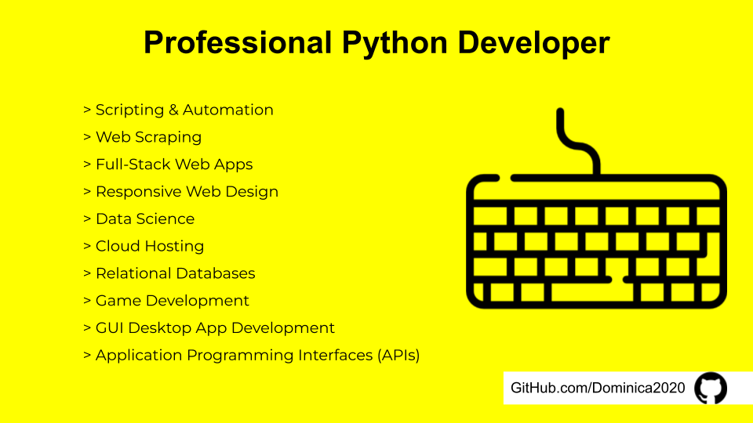

# Hey 👋🏽, I'm Dominica, thanks for stopping by!
## Background
- [About Me](https://cometolifeapps.io/about.html)

## Tech Focus
I specialize in python programming, its frameworks & libraries. As a full-stack engineer my preference is for back-end development. Interested in working with me? I'm happy to collaborate! 

## Connect with me:
- [LinkedIn](https://www.linkedin.com/in/dominicap)

## Languages & Tools:
Python • JavaScript • React.js • Bootstrap • MySQL • PostgreSQL • Flask • Django • APIs • Node.js • MongoDB • Databases • Docker • Kubernetes • Pandas • NumPy • Scikit Learn • Matplotlib • Selenium WebDriver • Seaborn • Beautiful Soup • Plotly • HTML • CSS • Git • Version Control
