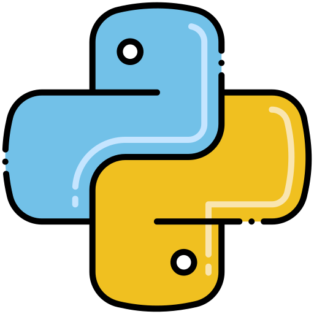
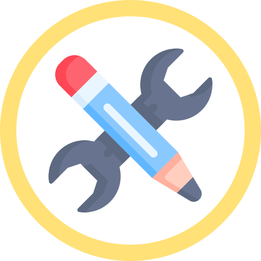
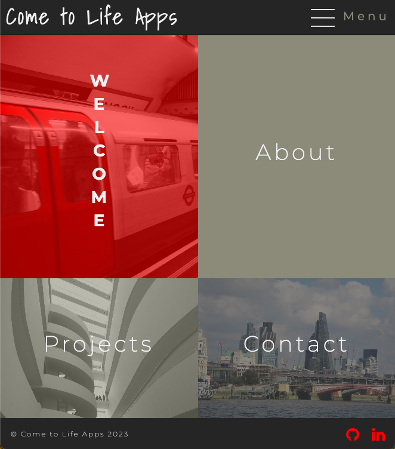

<h1 align="center">Hey 👋🏽, I'm Dominica!</h1>

Thanks for visiting! I am a self-taught python programmer with an eclectic background. I enjoy many things including: lifelong learning, entrepreneurship, natural sciences, exotic animals, music, Spanish, travel and tourism, architecture and real estate.

Over a four-year period I've completed professional development, certifications, self-paced bootcamps, and self-study in computer programming and data science. I also had the opportunity to offer freelance customized technology services.

Tech Training Sources: The App Brewery, Udemy, W3Schools, freeCodeCamp, Coursera, 365 Careers, Sololearn, YouTube, Google and Books.

## Tech Experience

- Python 3 Programming 
- Python Web Scraping
- Responsive Web Design
- Full-Stack Development 
- APIs & Databases (SQL & NoSQL)
- Python Libraries & Frameworks
- Object-oriented Programming (OOP)
- Technology Consulting & Education
- Data Science & Artificial Intelligence

## Additional Skills

- Spanish
- Research
- Entrepreneurship
- Lifelong Learning

## International Experience

- England
- Wales
- Germany
- France
- Italy
- Spain
- Peru
- Chile
- Costa Rica
- Ireland
- Colombia
- Netherlands
- El Salvador
- Monaco
- Vatican City State

## Previous Portfolio & Business
### ComeToLifeApps.io
Previous tech portfolio snapshot

### Isle of Apps 
Previous business

Made technology a breeze by providing smooth, reliable, fast & customized tech services. Clients saved time by cutting out the middleman - aka freelancing platforms.

## Languages & Tools

Python 3 • JavaScript • React.js • Bootstrap • Django • APIs • SQL • MySQL • NoSQL • Node.js • Express.js • MongoDB • EJS • npm • Pandas • NumPy • Scikit Learn • Matplotlib • Seaborn • Beautiful Soup • R • C • Heroku • HTML • CSS • jQuery • Git • GitHub • Version Control • Canva • Adobe Creative Cloud • Anaconda • Microsoft Visual Studio Code • PyCharm • IDLE • Jupyter Notebook • Web Scraping • Full-Stack Development • Web, App & Game Development • Object-oriented Programming (OOP) • Responsive Design • Databases • Data Science • AI • ChatGPT • Digital Product Management • Wireframes • Cloud Hosting • Frameworks & Libraries

 
 

  

